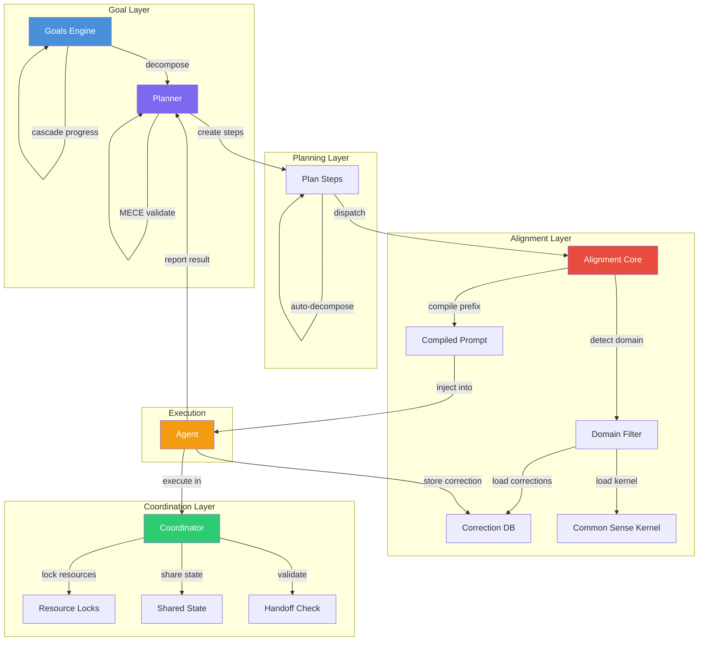
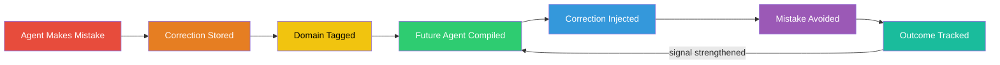

<p align="center">
  <h1 align="center">Autonomy Engine</h1>
  <p align="center">
    <strong>AI agents that learn from every mistake and never make the same one twice.</strong>
  </p>
  <p align="center">
    <a href="#quick-start">Quick Start</a> &middot;
    <a href="#how-it-works">How It Works</a> &middot;
    <a href="#architecture">Architecture</a> &middot;
    <a href="#the-correction-flywheel">The Correction Flywheel</a>
  </p>
  <p align="center">
    
    
    
    
  </p>
</p>

---

## What is this?

The Autonomy Engine is a goal-driven orchestration system that gives AI agents persistent memory, self-correcting behavior, and domain-aware judgment. Instead of starting every task from zero, agents inherit compiled knowledge from every agent that came before them.

## Why does this exist?

Every AI agent framework has the same fatal flaw: **agents start from zero every session.** They make the same mistakes repeatedly. They don't learn from corrections. They can't coordinate with other agents. And they have no concept of goals beyond the current prompt.

Other frameworks give you tools to *build* agents. This one gives agents **judgment.**

| What others do | What this does |
|---|---|
| Agent gets a task, executes it, forgets everything | Agent inherits corrections from every previous agent |
| Same mistake repeated across sessions | Mistake corrected once, corrected forever |
| Flat task execution | Hierarchical goals with dependency tracking and progress rollup |
| No coordination between agents | Resource locking, shared state, validated handoffs |
| Generic prompts | Domain-aware alignment injection compiled per-task |

## How it works

The engine operates in 5 phases:

### Phase 1: Goals
Decompose high-level objectives into hierarchical sub-goals with dependencies. Progress rolls up automatically from children to parents.

```python
from goals import GoalEngine

engine = GoalEngine()
parent = engine.create_goal("Ship v2.0", priority="high", status="active")
child1 = engine.create_goal("Build API", parent_goal_id=parent)
child2 = engine.create_goal("Write tests", parent_goal_id=parent)
engine.add_dependency(child2, child1)  # tests depend on API

# Progress cascades automatically
engine.complete_goal(child1)
engine.rollup_progress(parent)  # → 50%
```

### Phase 2: Planner
Convert goals into executable multi-step plans with agent assignments, template matching, and adaptive replanning when steps fail.

```python
from planner import Planner

planner = Planner()
plan_id = planner.create_from_template("build-feature", goal_id=goal_id)
planner.start_plan(plan_id)

# Plans self-validate for completeness
mece = planner.validate_mece(plan_id)
# {"valid": True, "coverage": 0.92, "overlap": 0.05}

# Complex steps auto-decompose into sub-plans
planner.decompose_all_complex_steps(plan_id)
```

### Phase 3: Alignment
Before any agent executes, compile a domain-aware prompt prefix from the kernel, corrections database, and strong agent framework. Every sub-agent gets the accumulated wisdom of the system.

```
$ python alignment.py compile --agent-name revit-builder --task "Create walls from PDF"

# Agent Execution Framework
[strong agent protocol...]

# Common Sense Kernel
[decision loop, verify loop, learning loop...]

## Relevant Corrections
- [BIM] Always validate dimensions against PDF source before creating walls
- [BIM] Use named pipes not HTTP for Revit communication
- [DESKTOP] Never use window_move — it's not DPI-aware

# Alignment Principles
- [CORE] Verify work before reporting done (priority 10)
- [CORE] Never skip corrections — always check memory (priority 9)
- [CORRECTION] Use DPI-aware positioning for windows (priority 9)
```

The output changes based on what the agent is about to do. A git task gets git corrections. A Revit task gets BIM corrections. An Excel task gets desktop corrections. Same engine, different compiled output.

### Phase 4: Coordinator
Track agent sessions across workflows. Lock shared resources. Share state between sequential agents. Validate handoffs.

```python
from coordinator import AgentCoordinator

coord = AgentCoordinator()
wf = coord.start_workflow("pdf-to-revit", project="Avon Park")

coord.register_agent(wf, "floor-plan-processor")
coord.acquire_lock("file", "/plans/floor1.pdf", wf, "floor-plan-processor")

# Agent finishes, shares state for next agent
coord.set_state(wf, "extracted_walls", walls_json, "floor-plan-processor")
coord.agent_completed(wf, "floor-plan-processor", result_summary="24 walls extracted")

# Next agent picks up shared state
walls = coord.get_state(wf, "extracted_walls")
```

### Phase 5: Integration
Domain-specific correction packs, kernel generation, and the injection pipeline that ties everything together.

```python
from inject import get_full_injection

# Full injection: kernel + domain corrections + generated supplements
prefix = get_full_injection(domains=["git", "filesystem"])

# Domain-selective: only what the agent needs
prefix = get_full_injection(domains=["bim"], core_only=True)
```

## The Correction Flywheel

This is the core innovation. When an agent makes a mistake and gets corrected:

1. The correction is stored with full context (what went wrong, what's right, how to detect it)
2. The correction is tagged to a domain (git, bim, desktop, filesystem, etc.)
3. Future agents working in that domain receive the correction automatically via alignment injection
4. The correction includes a detection pattern so agents recognize the situation before it happens
5. Outcome tracking measures whether each correction actually helps — high-signal corrections get prioritized, noise gets deprioritized

**The result:** The first agent to make a mistake is the last. Every subsequent agent in that domain inherits the fix. The system gets smarter with every failure instead of repeating it.

```
Agent makes mistake → Correction stored → Domain tagged →
Future agent compiled → Correction injected → Mistake avoided →
Outcome tracked → Signal strengthened
```

## Architecture



**The Correction Flywheel:**



## Stats

| Metric | Value |
|---|---|
| Tests passing | 663 |
| Domain correction packs | 8 (data, deployment, execution, filesystem, git, identity, network, scope) |
| Alignment principles | 16+ (core, domain, correction, user layers) |
| Plan templates | 4 built-in (build-feature, pdf-to-revit, client-deliverable, research-topic) |
| Core modules | 6 (goals, planner, alignment, coordinator, inject, domains) |
| Common Sense Kernel | 230+ lines of judgment heuristics |
| Proven in production | RevitMCPBridge (705 endpoints), desktop automation, multi-agent workflows |

## Quick Start

### Install

```bash
git clone https://github.com/WeberG619/claude-ai-tools.git
cd autonomy-engine
pip install -r requirements.txt
```

### Create a goal and execute it

```python
from goals import GoalEngine
from planner import Planner
from alignment import AlignmentCore

# 1. Define what you want to accomplish
engine = GoalEngine()
goal_id = engine.create_goal(
    "Automate floor plan conversion",
    priority="high",
    status="active",
    project="my-project"
)

# 2. Generate a plan
planner = Planner()
plan_id = planner.create_from_template("build-feature", goal_id=goal_id)
planner.start_plan(plan_id)

# 3. Get aligned prompt for each agent
alignment = AlignmentCore()
prefix = alignment.compile_prompt(
    agent_name="floor-plan-processor",
    task_description="Extract walls from PDF floor plan",
    project="my-project"
)

# 4. Inject alignment into your agent's prompt
full_prompt = prefix + "\n\n" + your_task_prompt

# 5. Track progress
planner.record_step_result(plan_id, step_index=0, success=True, summary="Walls extracted")
engine.rollup_progress(goal_id)
```

### CLI tools

```bash
# Goals
python goals.py create "Ship v2.0" --priority high --status active
python goals.py tree
python goals.py actionable

# Plans
python planner.py create "Build feature X" --template build-feature --goal-id 1
python planner.py status 1

# Alignment
python alignment.py compile --agent-name my-agent --task "my task description"
python alignment.py principles --domain bim
python alignment.py drift

# Domains
python domains.py list
python domains.py validate
```

## Project Structure

```
autonomy-engine/
├── goals.py              # Hierarchical goal tracking with dependency graph
├── planner.py            # Autonomous planning with MECE validation
├── alignment.py          # Domain-aware alignment injection
├── coordinator.py        # Cross-agent coordination and resource locking
├── inject.py             # Injection pipeline for sub-agents
├── domains.py            # Domain correction pack loader
├── kernel.md             # Common Sense Kernel v2.0
├── kernel-core.md        # Universal kernel (no user-specific rules)
├── domains/              # Domain-specific correction packs
│   ├── git.json          #   Git operations (3 corrections)
│   ├── filesystem.json   #   File system operations (3 corrections)
│   ├── execution.json    #   Execution patterns (2 corrections)
│   ├── network.json      #   Network operations (2 corrections)
│   ├── scope.json        #   Scope discipline (2 corrections)
│   ├── data.json         #   Data operations (1 correction)
│   ├── deployment.json   #   Deployment (1 correction)
│   └── identity.json     #   Identity/communication (1 correction)
├── test_goals.py         # Goal engine tests
├── test_planner.py       # Planner tests
├── test_alignment.py     # Alignment tests
├── test_coordinator.py   # Coordinator tests
├── test_sense.py         # Common sense tests
├── test_behavioral.py    # Behavioral tests
├── test_coherence.py     # Coherence tests
├── test_eval_parity.py   # Eval parity tests
├── test_selfcheck.py     # Self-check tests
├── test_aggregator.py    # Aggregator tests
└── test_permissions.py   # Permission tests
```

## How is this different?

**LangChain/LangGraph:** Graph-based agent orchestration. Great for defining flows. No persistent correction memory, no domain-aware injection, no goal hierarchy.

**CrewAI:** Role-based multi-agent teams. Agents have roles but don't inherit corrections from past executions. No self-repair loop.

**AutoGen:** Conversational multi-agent framework. Powerful for agent-to-agent chat. No correction flywheel, no hierarchical goal tracking, no alignment compilation.

**This engine:** Agents that get smarter over time. Every correction, every success pattern, every domain-specific lesson gets compiled into future agents automatically. Not a framework for building agents — a system for making agents that *learn*.

## Built With

This engine powers real production systems:

- **[RevitMCPBridge](https://github.com/WeberG619/RevitMCPBridge2026)** — 705+ endpoint bridge connecting AI to Autodesk Revit. The Autonomy Engine provides goal tracking, alignment injection, and correction learning for every Revit automation task.
- **Desktop automation workflows** — Multi-monitor, multi-app orchestration with correction-based window management, DPI-aware positioning, and visual verification loops.
- **Multi-agent development sprints** — Autonomous goal decomposition, parallel agent execution, and progress cascade across complex multi-step engineering tasks.

## License

MIT License. See [LICENSE](LICENSE).

## Author

**Weber Gouin** — Solo developer building AI infrastructure for AEC (Architecture, Engineering, Construction).

- [BIM Ops Studio](https://bimopsstudio.com)
- [GitHub](https://github.com/WeberG619)

---

<p align="center">
  <em>Stop building agents that forget. Start building agents that learn.</em>
</p>
